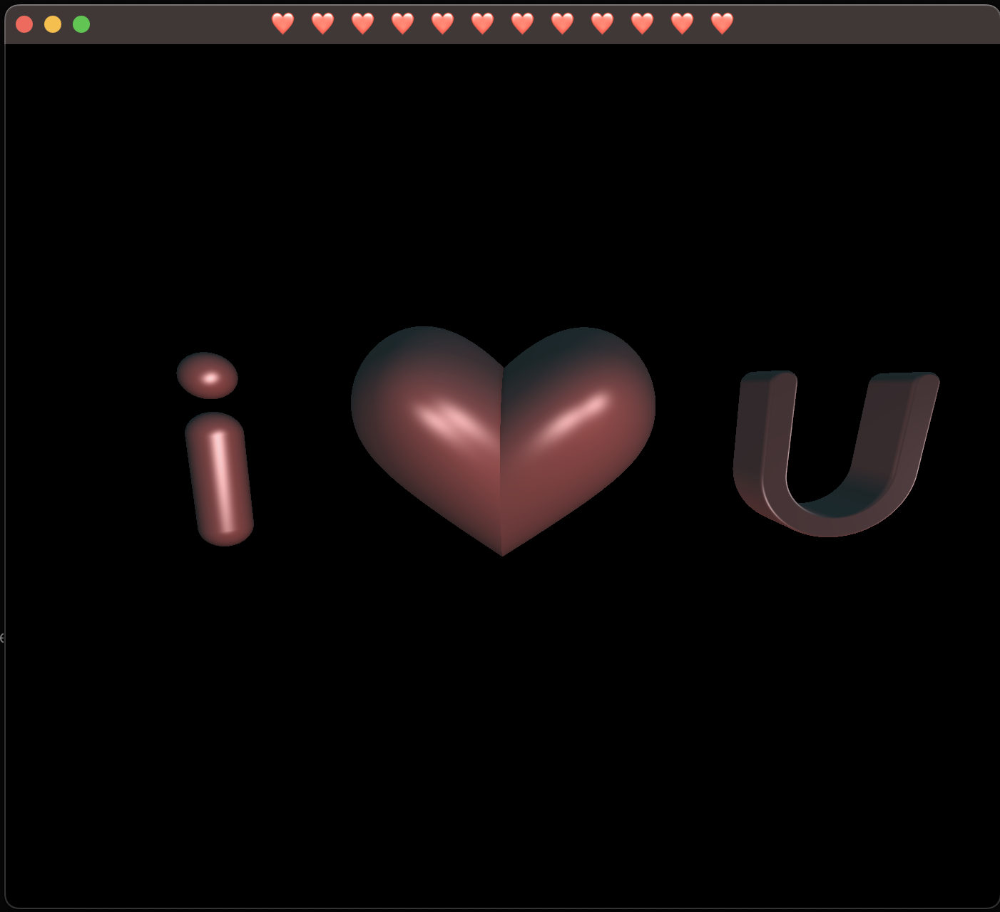

# Overview

Silly little app I made for my gf on Valentine's day. Pathtracing SDF renderer implemented in WGSL with some simple animation and phong illumination.



# Building From Source

The quickest way to build and run the app is
```bash
$ zig build run
```

To build the project for distribution, run
```bash
$ make release
```
which will generate a `release/ilu.tar.gz`.